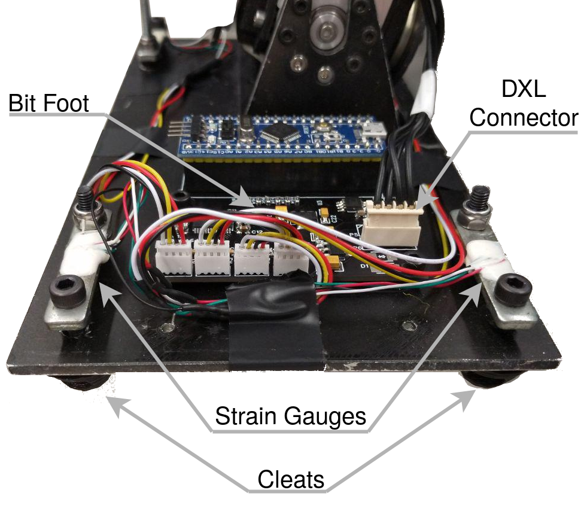

# BitFoot: Foot pressure sensor for a humanoid robot

This board measures 4 differential voltage signals from load cells. It connects to a RS485 or TTL Bus compatible with Dynamixel motors from Robotis.

We managed to achieve a sensor update rate of 697Hz. The board itself can be read faster than 1kHz from the Dynamixel bus.

Documentation is located [here](http://doku.bit-bots.de/meta/manual/hardware/electronics/bitfoot.html)

This board is based on the [ForceFoot](https://github.com/Rhoban/ForceFoot) by Rhoban

